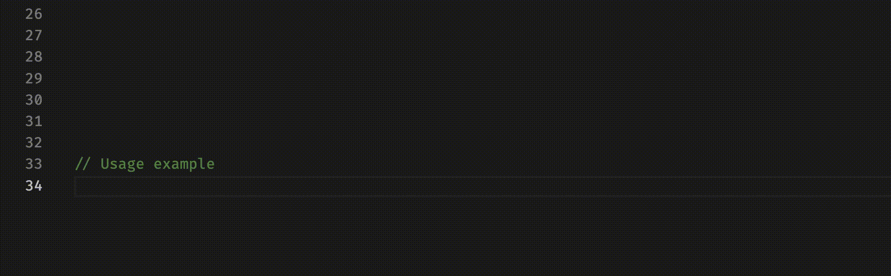

<AIBadge />

<Intro
  title={props.pageContext.frontmatter.title}
  readingTime={props.pageContext.frontmatter.readingTime}
  date={props.pageContext.frontmatter.date}
/>


<PhotoCaption>Photo by Mohammad Rahmani on Unsplash</PhotoCaption>

For a well-described API endpoint, we don't need to go to the implementation level to understand which parameters to provide.
The endpoint documentation should explain everything.
The same applies to React components.
Developers should know how to use components without checking implementation details.

When designing a _React_ component, think about how other developers will use the component.
This is especially important for design system components that are used across the whole system.

Imagine that we have a `Button` component that looks like this.
The component will render either `<button>` or `<a>` element, depending on the props provided.

```ts
type Props = {
  href?: string
  target?: string
  onClick?: VoidFunction
}

const Button = (props: Props) => {
  if (props.href && props.target) {
    return (
      <a href={props.href} target={props.target}>
        Click Me!
      </a>
    )
  }

  if (props.onClick) {
    return <button onClick={props.onClick}>Click Me!</button>
  }

  throw new Error("You should provide either href and target or onClick prop.")
}
```

This is a trivial example, but we already have some questions when using the component.
Which props to provide? What combination of props will render `<a>` element?
Imagine the confusion if this would have been a complex component.

As a user of this component, we won't know which properties to pass without looking at the implementation.
That will result in a bad developer experience.

## Discriminated Union

Luckily, we can improve prop types by using a discriminated union so that other developers know exactly how to use the component.

<Quote
  source="Discriminated Unions by IBM"
  sourceUrl="https://www.ibm.com/docs/hr/aix/7.2?topic=types-discriminated-unions"
>
  A discriminated union is **a union data structure that holds various
  objects**, with one of the objects **identified directly by a discriminant**.
  The discriminant is the first item to be serialized or deserialized
</Quote>

We know that Button component should receive different props depending if we want to render `<button>` or `<a>` element.
Therefore, we will have a different data structure for the button than for an anchor element.

In order to distinguish these two data structures, we will introduce a discriminant property called kind .
This is a property that can be either `"anchor"` or `"button"` .

```ts
type AnchorProps = {
  kind: "anchor"
  href: string
  target: string
}

type ButtonProps = {
  kind: "button"
  onClick: VoidFunction
}

type Props = AnchorProps | ButtonProps

const Button = (props: Props) => {
  switch (props.kind) {
    case "button":
      return <button onClick={props.onClick}>Click Me!</button>
    case "anchor":
      return (
        <a href={props.href} target={props.target}>
          Click Me!
        </a>
      )
    default:
      throw new Error("Unexpected value.")
  }
}
```

We constructed component Props by using a discriminated union type of `AnchorProps` and `ButtonProps` .

```ts
type Props = AnchorProps | ButtonProps
```

A switch case is used to narrow down the type. For anchor kind, _Typescript_ will realize that the props object has additional two fields: `href` and `target` .
Same for the button, after type narrowing, _Typescript_ will know that `onClick` is inside the props object.
The default case should never happen and _Typescript_ will warn us about that.



<PhotoCaption>Proper types for Button component</PhotoCaption>

Now other developers will know exactly how to use the component without looking at
the implementation level.

Until next time 👋

<Resources
  type="article"
  items={[
    {
      title: "Discriminated unions in official Typescript documentation",
      url: "https://www.typescriptlang.org/docs/handbook/2/narrowing.html#discriminated-unions",
    },
    {
      title: "Demystifying TypeScript Discriminated Unions",
      url: "https://css-tricks.com/typescript-discriminated-unions",
    },
  ]}
/>
