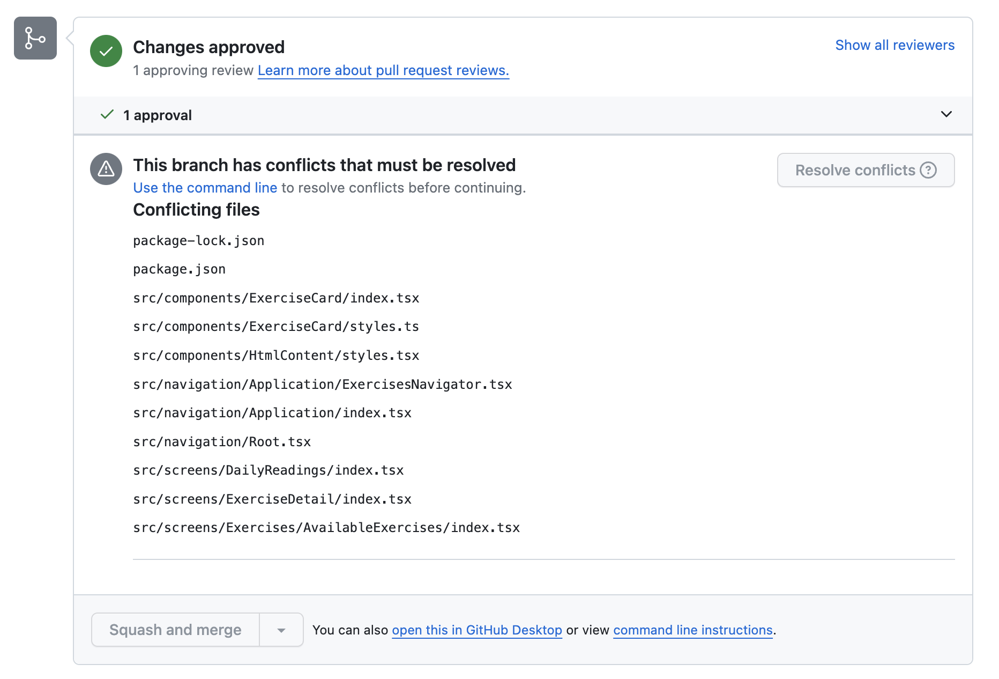
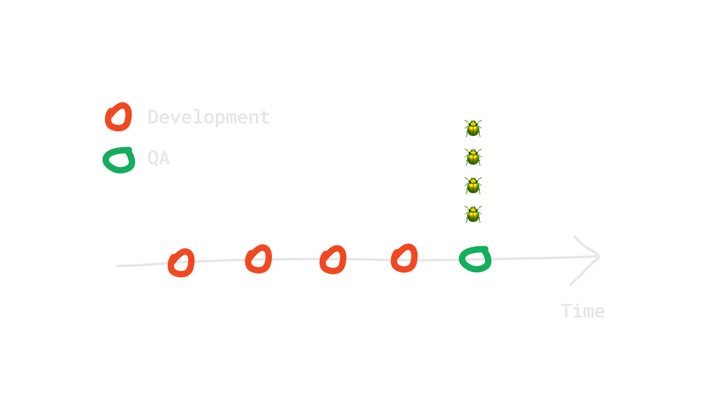
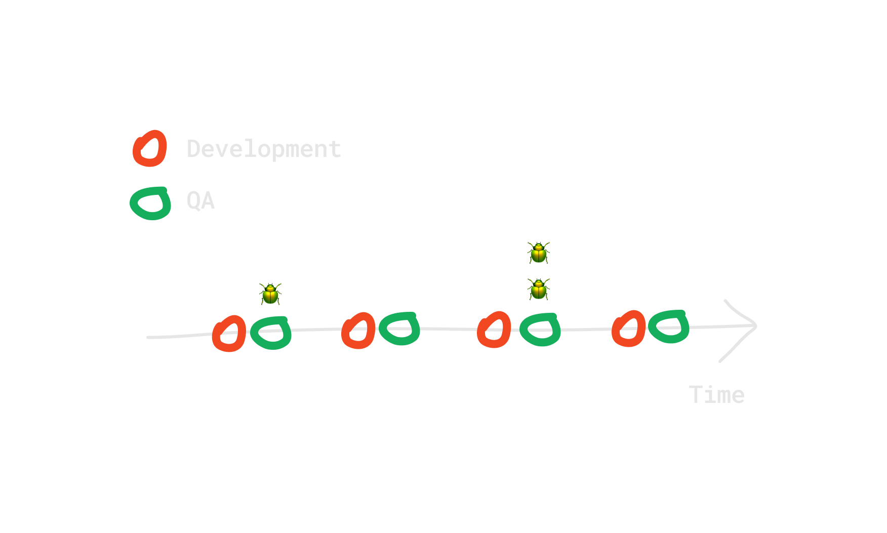

<AIBadge />

<Intro
  title={props.pageContext.frontmatter.title}
  readingTime={props.pageContext.frontmatter.readingTime}
  date={props.pageContext.frontmatter.date}
/>


<PhotoCaption>Photo by Jose Urbano on Unsplash </PhotoCaption>

You just had a sprint planning. The team decided to work on a new exciting AI feature that should solve real users' pain.
You estimated that the feature should take approximately one week to be finished completely. 

Feature requirements are pretty clear so you can dive into the development. 
As a first step, you open a new feature branch `my-awesome-feature` and share it with the team to work on.

..._One week after_...

You are close to the finish line — everything went as expected. 
You decide that it's time for QA to step in and test the feature before it is released. 
So, your logical next step is to merge the feature branch to the test branch. 

_- Easy, right?_ 

_- Well, no._

Before we move to the issues that already have happened in the background, let's start with the one that will be straight in your face.   

## Conflicts

It is not uncommon thing that we often forget to update feature branches with the latest changes. 
If it happens that we don't update the feature branch for quite some time then we will inevitably end up with conflicts. 

I'm pretty sure that you have seen something like this before 👇



I don't know about you, but seeing such conflicts makes me close the laptop, forever 😅.

Some conflicts are easy to resolve but some can give a real hit to the developer's experience. 
Comparing different versions line-by-line can be an exhausting experience. 

Or even worse, we are risking messing up the commit history or introducing new bugs with incorrect conflict resolution. 

One way to minimize the risk of conflicts is to set a reminder like this one:


But there is a better way — do not use (long-living) feature branches!

## Test as soon as possible

Now that conflicts are resolved, we merge the feature to the test branch. 
QA can step in and test the feature. Manually testing the whole feature takes time and QA might get back to us with an exhaustive list of bugs. 
This will inevitably prolong the delivery time.



As soon as there is a piece of feature reasonable to manually test, it should be pushed to testing. 
It doesn't have to be a complete feature. 



**Bugs caught sooner are less expensive than bugs caught later in the process.** 
The best time to catch bugs is during the development, and while writing unit/integration tests. 
The second best time is when you are self-reviewing published pull request before others.

Shorten the QA feedback loop — do not use (long-living) feature branches.

## Ship value as soon as possible

_The early bird catches the worm_ 🪱. The sooner we ship the value the better. More chance to catch the potential lead.

There are several reasons why we want ship value sooner:

1. Deliver value and get feedback from users
2. Less code changes = less risk that something will go wrong in production
3. The implementation does not have to be perfect to solve the problem
4. You will go faster even though it might feel slower

When working on a long living feature branch, all of the mentioned points are affected negatively. 

Before you even start with the development, you and your team bet on the solution you are going to build based on **assumptions**.
You believe that the solution will solve a specific user pain, need or desire based on the discovery you have already done before.  

However, what if it doesn't? You already spent time developing something just to realize that it's not solving the problem. 
It could have been discovered much sooner if you had released a smaller chunk to beta users. 

Shorten the users' feedback loop — do not use (long-living) feature branches.

## Feature toggles to the rescue

At this point, you might be wondering how to avoid long-living feature branches. 
To answer that question, we need to first answer these two:

- How to release without exposing the feature to the user?
- How to push the feature that is not completely finished?

Having unfinished feature in the production is completely fine. 
I'm not kidding. Hide it from the user and make sure it doesn't introduce breaking changes. 

Hiding the feature from unwanted eyes can be dead simple as following:

```jsx
if (devEnvironment || testEnvironment) {
  return <MyAwesomeFeature />
}
```

The snippet above will only render the component to be seen by developers and QA. 
This can be safely released in production as users won't see it. 

However, this simple solution is not ideal. We also want to show the feature to a subset of users in order to collect feedback.
In that case, we can use feature toggles. With feature toggles we can change the behavior in the application without any code changes.

```jsx
if (featureToogle.enableMyAwesomeFeature) {
  return <MyAwesomeFeature />
}
```

A feature toggle can be on a user level. That way, we can turn on/off different features for a specific user. 
Or we can create groups that will have access to specific features and assign users to the group. 
For example, we can have _beta users_ group which will have access to the new feature we want to test.

The implementation of feature toggles varies and is not standardized. It will depend entirely on your requirements.

Utilizing feature toggles does not guarantee a long-living feature branch absence. You can still get stuck in a long-living feature branch anyway.

Ultimately, it is up to you and your team to define the minimum scope and split the work into releasable chunks that 
will deliver value to the user without compromising the code quality.

<Resources 
  type="article" 
  items={[
    {
      title: "Feature Toggles (aka Feature Flags)", 
      url: "https://martinfowler.com/articles/feature-toggles.html"
    }
  ]} 
/>