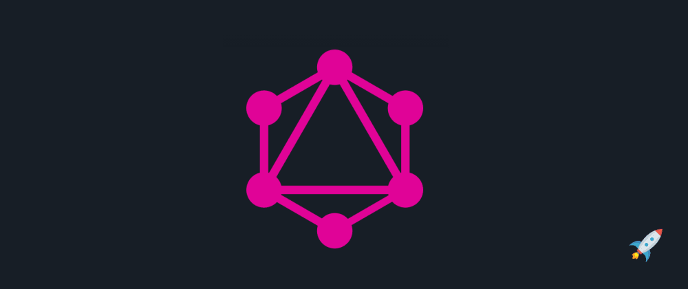
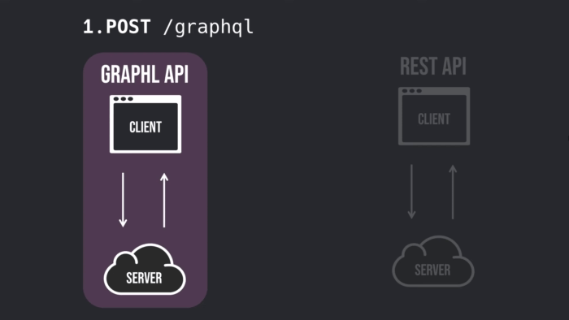

<Intro
  title={props.pageContext.frontmatter.title}
  readingTime={props.pageContext.frontmatter.readingTime}
  date={props.pageContext.frontmatter.date}
/>



Whoo, already X years have passed since Facebook publicly released GraphQL in 2015.
It's not anymore just a new shiny thing - GraphQL ecosystem greatly matured and you should take it into consideration when choosing between different API design approaches.

If you're new to GraphQL, this article will help you understand how
the client-server communication works and what are key differences between GraphQL and, most commonly used, RESTful API.

I'll show you how to make a request from the client to the server and we'll examine what is happening in the process.
So, let's get started!

## Schema and data types

Imagine that you're an astronaut 👨‍🚀. You want to buy a spaceship so that you can travel the universe with your friends.
As an astronaut, you know about spaceship properties so you can easily define a type for it:

```graphql
type Spaceship {
  model: String!
  weight: Float
  speed: Int
  turboEnabled: Boolean
}
```

For defining Spaceship object type we've used something called _"GraphQL schema definition language"_ or shortly - `GraphQL SDL`.

All Spaceship fields are built-in scalar types. GraphQL has 5 built-in scalar types: `Int`, `Float`, `String`, `Boolean` and `ID`.
We're not restricted to only scalar types, a field type can be another object type or [enumeration](https://graphql.org/learn/schema/#enumeration-types).

Notice how we've used an exclamation mark after the type name - `String!`.
By using an exclamation mark we're expecting from the server to return a non-null value for the field.
In the case that server returns `null` value for that field, an execution error will be triggered.

Now that we know how to use GraphQL SDL, let's define an object type for a shop 🛒 where we can actually buy a spaceship:

```graphql
type Shop {
  name: String!
  address: String!
  spaceships: [Spaceship]
}
```

Every shop has a wide range of spaceships to offer - therefore, we have a field type `[Spaceship]` which represents a list of spaceships.
Before moving further, we need to define how we can query our data. For this purpose, we should use a special `Query` object type:

```graphql
type Query {
  spaceships: [Spaceship]
  shop(name: String!): Shop
}
```

We can look at `Query` fields as routes in REST - they are an entry point of the API.
By examining `Query` type we can find out which data we can get from the server.
In this case, we can get a list of spaceships and/or we can get a shop by name.

Finally, our GraphQL schema looks like this:

```graphql
type Spaceship {
  model: String!
  weight: Float
  speed: Int!
  turboEnabled: Boolean
}

type Shop {
  name: String!
  address: String!
  spaceships: [Spaceship]
}

type Query {
  spaceships: [Spaceship]
  shop(name: String!): Shop
}
```

Defining a schema should not be a task for Backend developers only.
Frontend developers should also take a part in it because, in the end, they will consume the data from the server and use the schema as a documentation.

## Query construction

This is the part where a client comes into play.
We have our schema defined so we can perform queries to fetch some data.
Writing a query is simple - it's basically selecting fields that you need.
Let's say that you want a list of spaceships, but you only need their model and speed, nothing else.

You would write a query like this:

```graphql
{
  spaceships {
    model
    speed
  }
}
```

After that, perform a request to the GraphQL server with the query attached as a query parameter for GET requests or in body for POST requests.

```js
fetch("/graphql", {
  method: "POST",
  headers: {
    "Content-Type": "application/json",
    Accept: "application/json",
  },
  body: JSON.stringify({ query: "{ spaceships { model speed } }" }),
})
```

If everything went well, you'll receive a response like this:

```json
{
  "data": {
    "spaceships": [
      {
        "model": "Mercury Conqueror",
        "speed": 2000
      }
      //...
    ]
  }
}
```

Additionally, if you want to get a shop by name along with the list of spaceships, you don't have to perform another request with a different query.
You can modify the previous query and add additional fields. This way, we can get everything we need in just one request.



Things in the REST API world are a little bit different, if you want to get:

a list of spaceships, you would probably have to do a `GET` request to the `/spaceships` route
a shop by name, you would have to do a `GET` request to the `/shop/:shopName` route


You may notice that we had to do more requests with REST to fetch everything we need.
Not only that we did more requests bgrut we also get data that we don't necessarily need, meaning that we are [over-fetching](https://stackoverflow.com/questions/44564905/what-is-over-fetching-or-under-fetching) because an endpoint returns a fixed data structure.
With GraphQL, you don't have to worry about under-fetching or over-fetching because you ask only for what you need 💰.

## Parse, validate and execute

We're on the server side now; handling requests in REST is straightforward - every route (endpoint) is associated with a function (controller).
When server receives a request it executes the function and returns result to the client.
In most cases, before reaching the controller, we'll have to parse, validate and sanitize data that we've received from the client.

On the other side, GraphQL takes the query from our request and parses it to the [_Abstract Syntax Tree (AST)_](https://stackoverflow.com/questions/46163036/what-is-ast-in-graphql).
After parsing, it will take our schema and validate received query against it.
We don't have to worry if client didn't send required data, provided a string instead of a number or maybe queried non-existing fields. GraphQL takes care of it and punishes the client with an error if necessary. If everything's fine, we can proceed to the execution phase.

## Execution phase

GraphQL needs to know how to resolve each field for a given query.
As a reminder, our `Query` object type provides two possible queries: `spaceships` and `shop(name: String!)`.

```graphql
type Query {
  spaceships: [Spaceship]
  shop(name: String!): Shop
}
```

To teach GraphQL how to resolve each field we have to write a resolver function for every `Query` field.
The resolver function likely accesses database or does whatever needed to get the data and return it back.

```js
const resolvers = {
  Query: {
    spaceships(obj, args, context, info) {
      return db.findAllSpaceships()
    },
    shop(obj, args, context, info) {
      return db.findShopByName(args.name)
    },
  },
}
```

**Note**: GraphQL is language agnostic and it is supported by many different languages.
We're using JavaScript here. You can check [here](https://the-guild.dev/graphql/tools/docs/resolvers#resolver-function-signature) for more details about resolver arguments.

We can write resolvers for `Spaceship` and `Shop` object fields too.
For example, we can resolve the speed field and return a different value if `turboEnabled` is set to `true`:

```jsquer
const resolvers = {
    Query: {...},
        Spaceship: {
            speed(obj, args, context, info) {
                return obj.turboEnabled
                    ? obj.speed \* 2
                    : obj.speed
        }
    }
}
```

By default, if we omit resolvers, GraphQL resolves a field by returning property of the same name.
GraphQL traverses tree and resolves each node (field). Resolved values will produce a key-value map that mirrors the original query. This result is sent to the client which requested it.


## GraphQL use cases

Great thing about GraphQL is that you can place it on top of already existing API, so you don't have to do everything from scratch.
A common use case for using GraphQL is when the client needs the data from multiple sources.
With GraphQL you can aggregate the data and let the client consume it from a single point in a standardized way.

Another use case is when there are multiple different clients which are using different data.
Most likely, those clients will have to do several requests just to fetch needed data and will be prone to over-fetching and under-fetching. With GraphQL you can let every client choose which data to fetch.

## What's next?

We only scratched the surface. If you want to explore further, I encourage you to check following links:

- [Official GraphQL website](https://graphql.org/)
- [How to GraphQL](https://www.howtographql.com/)
- [Apollo GraphQL](https://www.apollographql.com/)
- [Tutorialspoint - GraphQL](https://www.tutorialspoint.com/graphql/index.htm)
- [GraphQL Full Course - Novice to Expert](https://www.youtube.com/watch?v=ed8SzALpx1Q)
