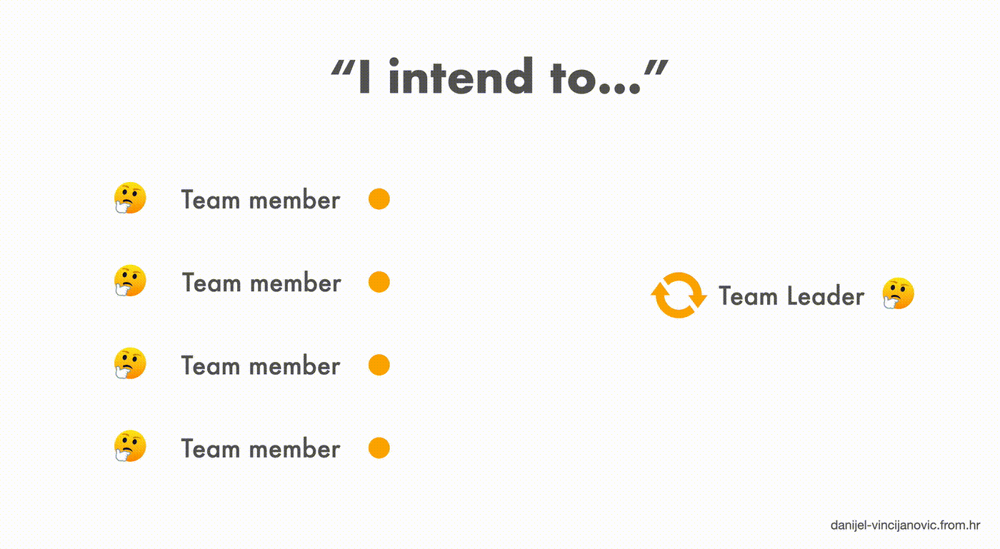

<Intro
  title={props.pageContext.frontmatter.title}
  readingTime={props.pageContext.frontmatter.readingTime}
  date={props.pageContext.frontmatter.date}
/>

When I started my development journey as a junior developer, I used to be the one constantly seeking permission before doing anything.
I didn't feel competent and confident enough to do something without first asking for approval.

At that time, it felt like a cautious move, but it had more implications than I could have imagined.

## **The Old Way: Seeking Permission**

It was like a ritual—waiting for approval from above before I could proceed.
What I didn't know was that my seeking permission way of communicating was making myself and the rest of the team slower.
I wasn't ready to take responsibility for the decision, and it was reflected in the way I communicated.

## **The Turning Point: Embracing "I Intend To"**

Working with much experienced people revealed to me their different communication style:

<Quote>
  Instead of asking **"Do you think we should do this?"** they were saying, **"I
  intend to do this."**
</Quote>

It might seem like a subtle shift, but trust me, it sparks a major transformation.

It's a little tweak that completely changed my approach. It's a switch from the usual permission-seeking to confidently stating _"I intend to."_
All of a sudden, I wasn't stuck in limbo waiting for validation.
I was stepping up, sharing my intentions with all reasoning and, most importantly, taking responsibility for my actions.

That way, we are moving the authority and decision making to the lower level.
The upper level only needs to notice and review your intention and say _"Very well"_.
This does not mean that it takes away all of their responsibility and thinking.
They can focus on the bigger picture while still having all the intentions in mind.

## **The Power of "I Intend To"**

Here's why this shift was such a game-changer for me:

1. **Empowering the Team:** _"I intend to"_ isn't just a phrase; it's an invitation for the team to actively participate in decision-making. It's a way of distributing leadership authority and fostering a sense of ownership.
2. **Speed and Agility:** By bypassing the approval-seeking stage, team gains momentum. The team adapts quickly to changes and embraces a more agile way of working.
3. **Fostering Collaborative Discussions:** Stating intentions encouraged open conversations. Team members share their insights, identify potential challenges, and collectively craft innovative solutions.
4. **Leading by Example:** Junior developers can learn not only technical skills but also about thoughtful decision-making and inclusive leadership.

## **Unveiling the "I Intend To"**

I realized that leadership isn't about holding all the answers; it's about empowering every team member to contribute their unique insights.

Embracing _"I intend to"_ wasn't just about adjusting my communication style; it marked a shift in my entire perspective.
This change in mindset had a profound impact on how I work and collaborate. It's a small phrase that carries immense empowerment.

So, if you ever find yourself caught up in the loop of seeking permission, consider trying out the _"I intend to"_ approach. It might feel different initially, but it's worth the experiment.
My journey was transformed by a simple shift in communication and so can be yours.

<Divider />

<Resources
  items={[
    {
      title:
        "Turn the Ship Around! A True Story of Turning Followers into Leaders",
      url: "https://davidmarquet.com/turn-the-ship-around-book/",
    },
  ]}
/>
