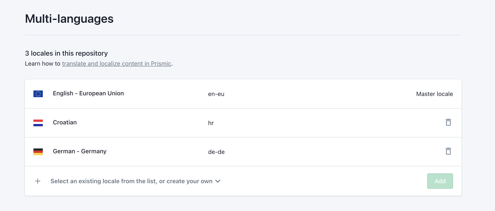
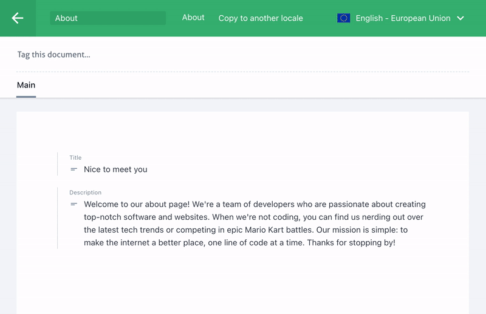
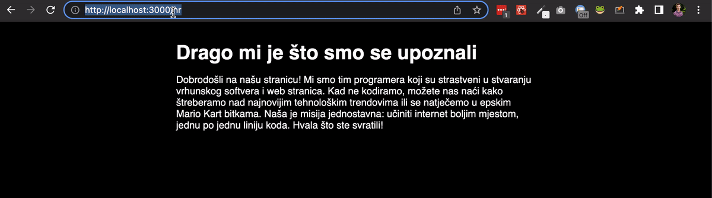

<Intro
  title={props.pageContext.frontmatter.title}
  readingTime={props.pageContext.frontmatter.readingTime}
  date={props.pageContext.frontmatter.date}
/>


<PhotoCaption>Photo by Greg Rakozy on Unsplash</PhotoCaption>

_How are you?_
Or should I say - _Wie geht es dir?_ 🇩🇪
Or maybe - _Kako si?_ 🇭🇷

I hope you are doing well and that you are ready to develop a website that supports multiple languages. Internationalization, or shortly i18n, is the process of designing a software that can be adapted to different language without engineering changes.

In this article, we will go through the basic i18n setup with [Next.js](https://nextjs.org) and headless CMS.
We will support three languages:

- English (default)
- German and
- Croatian

This setup is extendable to any number of languages and will work with any kind of headless CMS that you choose with some minor tweaks in the code.
We will use [Prismic CMS](https://prismic.io).

Setting up i18n on the website will be divided into two parts:

- **Internationalization routing** and content that will be changed often by content editors
- **Component internationalization** for the content inside components that won't be changed that often by content editors

## Internationalization routing

First thing that we need to do is to create a new repository in Prismic and add all languages in settings.



<PhotoCaption>Language settings in Prismic</PhotoCaption>

In order to generate pages for all available languages we need to get repository languages that we will use in `next.config.js`.
We create a Prismic client by calling `prismic.createClient` and providing Prismic REST API V2 endpoint for the repository.

After that, we can get locales and pass them to `i18n` in `next.config.js`.

```ts
const prismic = require("@prismicio/client")

const nextConfig = async () => {
  const client = prismic.createClient("https://intl-website.prismic.io/api/v2")

  const repository = await client.getRepository()
  const locales = repository.languages.map(lang => lang.id)

  console.log(locales)
  // [ 'en-eu', 'de-de', 'hr' ]

  return {
    i18n: {
      locales,
      // default locale will be `en-eu` - it's always the first element
      defaultLocale: locales[0],
    },
    reactStrictMode: true,
  }
}

module.exports = nextConfig
```

Now if we create a page `pages/about.tsx`, the configuration above will result in the following URLs:

- `/about` - default locale without prefix
- `/about/en-eu` - English version
- `/about/de-de` - German version
- `/about/hr` - Croatian version

Internationalized routes will be generated when building the project and that's all we need regarding configuration.
The next step is to fetch different content depending on a given `locale`.

To do that, we will create a content for about page in Prismic and fill it for all languages.
For simplicity, the content consists of only `title` and `description` field.



Once the content is in place, we can fetch it in [`getStaticProps`](https://nextjs.org/docs/basic-features/data-fetching/get-static-props) for each locale.
The result is passed to `About` page as props.

```tsx
import React from "react"
import * as prismic from "@prismicio/client"

type Props = {
  title: string
  description: string
}

export default About = ({ title, description }: Props) => {
  return (
    <>
      <h1>{title}</h1>
      <p>{description}</p>
    </>
  )
}

export async function getStaticProps({ locale }: { locale: string }) {
  const client = prismic.createClient("https://intl-website.prismic.io/api/v2")
  const about = await client.getSingle("about", { lang: locale })

  return {
    props: about.data,
  }
}
```

The basic setup for internationalized routes is now completed and this is how our website looks like so far 👇



## Component internationalization

<Quote>
  ⚠️ Exporting static pages is **not** possible if you are using
  Internationalization Routing
</Quote>
