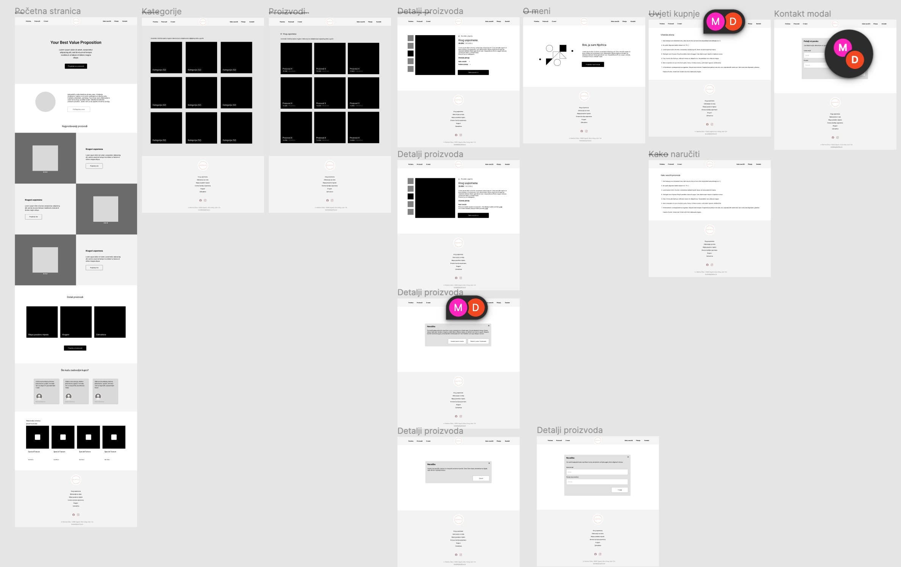

<Intro
  title={props.pageContext.frontmatter.title}
  readingTime={props.pageContext.frontmatter.readingTime}
  date={props.pageContext.frontmatter.date}
/>

<PhotoCaption>Photo by Greg Rakozy on Unsplash</PhotoCaption>

In my recent [post on LinkedIn](https://www.linkedin.com/posts/davinci2015_attention-all-entrepreneurs-and-business-activity-7054860124821106688-Jrwa?utm_source=share&utm_medium=member_desktop), I offered a free website with 
**the goal to review the effectiveness of ChatGPT and Midjourney for the website development** while providing value to the community.

I was lucky enough to get an inquiry from a small local business that was interested in the website creation - meet [Njofrica](https://www.instagram.com/studio.njofrica). 🤩

Njofrica crafts different home decorations and gifts that will warm the hearts of your closest ones.
Our goal is to create a website that showcases their beautiful products and tells their brand story.

<PhotoCaption>Beautiful gift crafted by Njofrica</PhotoCaption>

# Initial meeting with the client

As I want to rely on ChatGPT during the process, I prompted ChatGPT to prepare me for the initial meeting with the client and give me the outline for the call with all questions that I should go through with the client.

This was my prompt:

<Quote>
  I'm building a website for a company that is selling personal family gifts.
  Prepare me for the initial meeting with the client.
</Quote>

and this is the reply:

<Quote>
1. Familiarize yourself with the company: Before the meeting, make sure to do some research on the company, its history, values, and mission. This will help you better understand the client's needs and preferences.
2. Identify the project goals: During the meeting, be sure to ask your client about their project goals.
   1. What do they want to achieve with their website?
   2. Who is their **target** **audience**?
   3. What would make this project successful?
3. Discuss **branding** and **design**: The design of the website is critical for any business, and it's essential to understand the branding and design preferences of your client. Ask questions about their desired color scheme, imagery, and overall visual identity.
4. Discuss **website** **features** and **functionality**: Ask your client about the features they would like on their website, such as e-commerce capabilities, social media integration, and contact forms. Discuss how the website will be structured and organized, including the menu and page hierarchy.
5. Address **technical** **requirements**: Talk to your client about technical requirements like web **hosting**, and **content** **management** systems. This will help ensure that you have a clear understanding of what is needed to build the website.
</Quote>

With this initial reply, without any additional variations, I was able to establish a structured framework for the meeting and gather relevant insights to present to the client.
While I could have conducted the meeting on my own, having ChatGPT as a supportive tool proved to be helpful in organizing my thoughts and preparing an agenda.

During the meeting, we had fruitful discussions about Njofrica's unique selling points, target audience, and desired features for the website.
We were able to align our understanding and establish a direction for the project.

With the initial steps agreed upon, next focus is to gather all the necessary resources from the client.
This includes their branding materials, product images, product categories, and any other content that will be integral to the website.

After that, we will dive into the process of site navigation and wireframing.
Wireframes will provide a skeletal representation of the website's layout, allowing us to refine and iterate before moving on to the development phase.

# Wireframing

Following the initial client meeting, requirements gathering, and discussion of the website's objectives, we now proceed to the second phase of the project: wireframing.

When it comes to wireframing, I have found ChatGPT to be limiting and not particularly advantageous for two primary reasons:

- Lack of visual representation - as it relies on text-based interactions, it cannot directly produce visual wireframes. While it can describe wireframes, you will need to rely on other tools or software to translate the textual representations into visual designs.

- Lack of creativity and intuition - it may not always capture the subtleties and little things that make designs truly effective or user-friendly. It can't understand the story the client wants to tell and has limited contextual understanding. It can sometimes misinterpret instructions, leading to incorrect or inconsistent wireframe suggestions.
  You may need to provide clarifications or rephrase instructions to get the desired output.

ChatGPT does offer potential assistance in suggesting the navigation structure and information architecture. But, in order to do that, you need to provide a lot of context and a detailed description.
It is usually missing the complete picture required to deliver truly valuable results.

<PhotoCaption>A sneak peek into wireframes created in Figma</PhotoCaption>

# Development

Things got quite interesting in the development phase. As ChatGPT takes text as input, it turns out it's much more useful in development compared to wireframing and design.

Here's how ChatGPT proved to be a valuable asset in the coding phase:

💎 _Tech Stack Recommendations_

- ChatGPT positively surprised me by suggesting the most suitable technologies based on my project requirements with detailed explanations. Although I had an idea of which technologies to use, it helped me to confirm my decision.

💎 _Efficient Component Creation_

- I handed over design tokens and code guidelines to ChatGPT, who then became my coding assistant. It generated boilerplate code for components, saving me from repetitive manual work. I simply described a component, its properties, and variants, and ChatGPT delivered a ready-to-use component that I could customize with ease.

💎 _Quick idea bouncing_

- Whenever I encountered some issue, ChatGPT offered quite a few options that I could choose from. Sometimes it can be annoying as it will continuously provide you with useless information while sounding confident about it.

While ChatGPT accelerated development and enhanced efficiency, it's important to remember that it's not a complete replacement. Developers still need to steer the project and maintain control. It can help but it can not think instead of you.

Check the result: 🌐 **[Njofrica website](https://njofrica.netlify.app/)** 🌐

⚠️ _Bear in mind that the website contains placeholder content at the moment and will be filled soon by the website owner._

Until next project 👋
