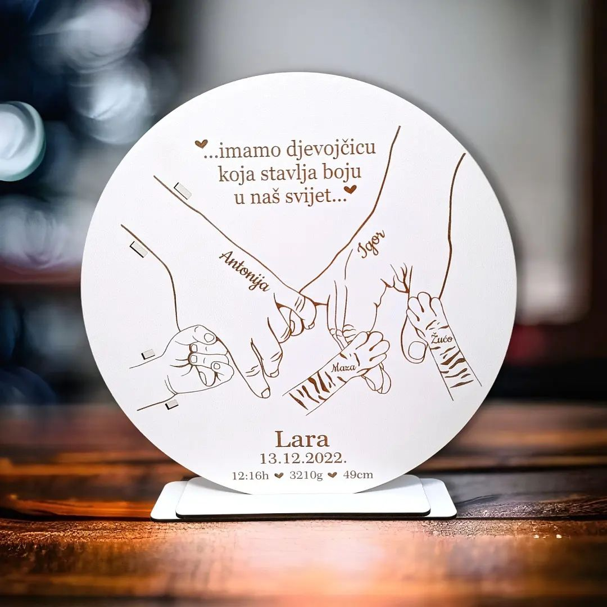

<Intro
  title={props.pageContext.frontmatter.title}
  readingTime={props.pageContext.frontmatter.readingTime}
  date={props.pageContext.frontmatter.date}
/>

<PhotoCaption>Photo by Greg Rakozy on Unsplash</PhotoCaption>

In my recent [post on LinkedIn](https://www.linkedin.com/posts/davinci2015_attention-all-entrepreneurs-and-business-activity-7054860124821106688-Jrwa?utm_source=share&utm_medium=member_desktop), I offered a free website with 
**the goal to review the effectiveness of ChatGPT and Midjourney for the website development** while providing value to the community.

I was lucky enough to get an inquiry from a small local business that was interested in the website creation - meet [Njofrica](https://www.instagram.com/studio.njofrica). 🤩

Njofrica crafts different home decorations and gifts that will warm the hearts of your closest ones.
Our goal is to create a website that showcases their beautiful products and tells their brand story.

<PhotoCaption>Beautiful gift crafted by Njofrica</PhotoCaption>

# Initial meeting with the client

As I want to rely on ChatGPT during the process, I prompted ChatGPT to prepare me for the initial meeting with the client and give me the outline for the call with all questions that I should go through with the client.

This was my prompt:

<Quote>
  I'm building a website for a company that is selling personal family gifts.
  Prepare me for the initial meeting with the client.
</Quote>

and this is the reply:

<Quote>
1. Familiarize yourself with the company: Before the meeting, make sure to do some research on the company, its history, values, and mission. This will help you better understand the client's needs and preferences.
2. Identify the project goals: During the meeting, be sure to ask your client about their project goals.
   1. What do they want to achieve with their website?
   2. Who is their **target** **audience**?
   3. What would make this project successful?
3. Discuss **branding** and **design**: The design of the website is critical for any business, and it's essential to understand the branding and design preferences of your client. Ask questions about their desired color scheme, imagery, and overall visual identity.
4. Discuss **website** **features** and **functionality**: Ask your client about the features they would like on their website, such as e-commerce capabilities, social media integration, and contact forms. Discuss how the website will be structured and organized, including the menu and page hierarchy.
5. Address **technical** **requirements**: Talk to your client about technical requirements like web **hosting**, and **content** **management** systems. This will help ensure that you have a clear understanding of what is needed to build the website.
</Quote>

With this initial reply, without any additional variations, I was able to establish a structured framework for the meeting and gather relevant insights to present to the client.
While I could have conducted the meeting on my own, having ChatGPT as a supportive tool proved to be helpful in organizing my thoughts and preparing an agenda.

During the meeting, we had fruitful discussions about Njofrica's unique selling points, target audience, and desired features for the website.
We were able to align our understanding and establish a direction for the project.

With the initial steps agreed upon, next focus is to gather all the necessary resources from the client.
This includes their branding materials, product images, product categories, and any other content that will be integral to the website.

After that, we will dive into the process of site navigation and wireframing.
Wireframes will provide a skeletal representation of the website's layout, allowing us to refine and iterate before moving on to the development phase.

Stay tuned as we continue to bring Njofrica's website to life! 
I will keep posting the progress on my [LinkedIn profile](https://www.linkedin.com/in/davinci2015).
